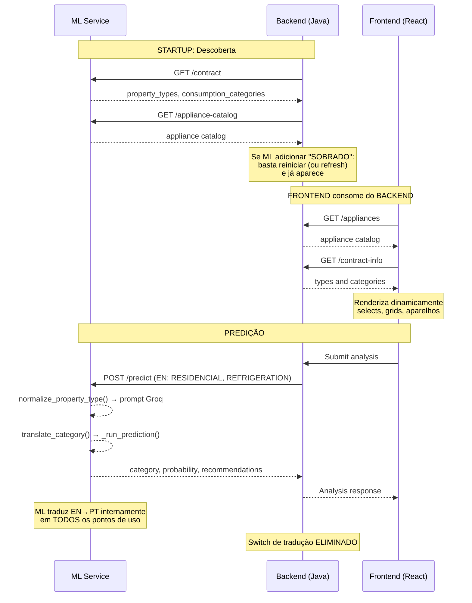
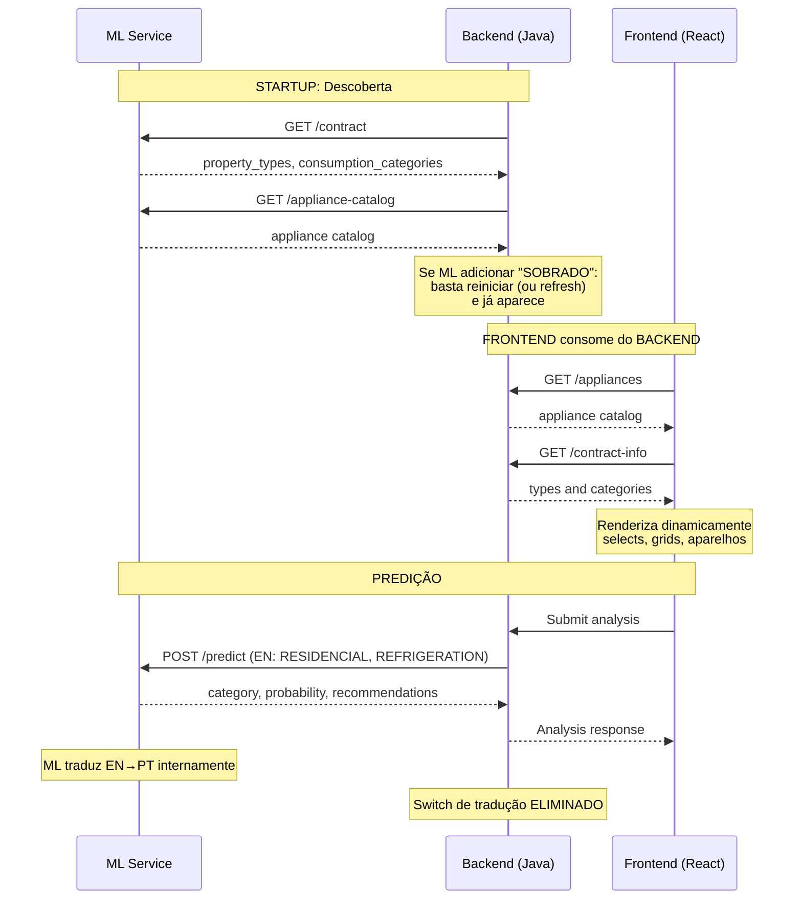

# ADR-0027: Contrato em Inglês e Descoberta Automática de Mudanças no ML Service

## Status

Aceito

## Contexto

O ML Service (Python/FastAPI) é a fonte de verdade para classificação energética. Ele define
quais tipos de imóvel, categorias de consumo, categorias de eficiência e aparelhos são
reconhecidos pelo modelo. No entanto, qualquer alteração nesses dados hoje exige retrabalho
manual em múltiplas camadas.

**Problema concreto:** O modelo ML reconhece 3 tipos de imóvel (`Casa`, `Apartamento`,
`Comercial`) e 7 categorias de consumo (`Refrigeracao`, `Climatizacao`, `Tecnologia`,
`Iluminacao`, `Eletrodomesticos`, `Servicos`, `Outros`). Mas o backend e frontend
só conhecem 2 tipos (`RESIDENCIAL`, `COMERCIAL`) e 5 categorias (sem `Servicos`).

Isso acontece porque os valores estão hardcoded em três lugares:

- **ML Service:** Modelo treinado com dados PPH 2019 em português. Endpoints existentes
  `/predict-schema` e `/categories` expõem parte do schema, mas em português e sem
  cobertura completa (faltam tipos de imóvel, catálogo de aparelhos).
- **Backend:** Enums `PropertyType` e `EquipmentCategory` fixos em código Java.
  `EnergyAnalysisService.buildMlRequest()` mantém um `switch` manual para traduzir
  `RESIDENCIAL → "Casa"`, e simplesmente ignora `APARTAMENTO`.
- **Frontend:** `PROPERTY_TYPES`, `CATEGORIES`, `CATEGORY_ORDER` e `APPLIANCE_FALLBACK`
  todos hardcoded em português.

**Objetivo central desta ADR:** Fazer com que alterações no ML Service (adição, remoção
ou modificação de tipos de imóvel, categorias de consumo e aparelhos) sejam detectadas e
propagadas automaticamente para backend e frontend, eliminando a necessidade de alterações
manuais para mudanças triviais no ML.

## Decisão

A equipe decidiu implementar dois mecanismos complementares:

**A) Endpoints de descoberta no ML Service** - Expõem o contrato completo e o catálogo
de aparelhos em inglês, permitindo que backend e frontend descubram dinamicamente os
valores suportados.

**B) Normalização EN->PT no ML Service** - O ML Service aceita inglês nos campos
categóricos da requisição e traduz internamente para o formato que o modelo foi treinado
(português), eliminando a necessidade de tradução no backend.

### A) Endpoints de Descoberta

#### A.1. Endpoint `/contract`

Unifica e expande os endpoints atuais `/predict-schema` e `/categories` em um único
endpoint que expõe todo o contrato do ML Service em inglês:

```python
@app.get("/contract")
def contract():
    """Retorna o contrato completo do ML Service para descoberta dinâmica."""
    return {
        "version": "3.0.0",
        "property_types": ["RESIDENCIAL", "APARTAMENTO", "COMERCIAL"],
        "efficiency_categories": ["EXCELENTE", "BOM", "MEDIANO", "RUIM", "CRITICO"],
        "consumption_categories": [
            "REFRIGERATION", "CLIMATE_CONTROL", "TECHNOLOGY",
            "LIGHTING", "APPLIANCES", "SERVICES", "OTHERS"
        ],
        "request_schema": PredictRequest.model_json_schema(),
        "response_schema": PredictResponse.model_json_schema(),
    }
```

**Efeito:** Se o ML Service adicionar um novo tipo de imóvel (`"SOBRADO"`) ou uma nova
categoria (`"HEATING"`), basta atualizar esse endpoint. Backend e frontend descobrem
automaticamente. O backend já possui `MlSchemaDiscovery` (ApplicationRunner) e
`MlSchemaRegistry` que consomem schemas do ML no startup - este endpoint substitui as
chamadas atuais a `/predict-schema` e `/categories`.

#### A.2. Endpoint `/appliance-catalog`

Expõe o catálogo completo de aparelhos que o modelo reconhece, com nomes em português
(dados do mundo real) e `ml_category` em inglês (identificador de código):

```python
@app.get("/appliance-catalog")
def appliance_catalog():
    """Retorna o catalogo de aparelhos que o modelo reconhece."""
    df_pph = pd.read_csv(os.path.join(BASE_DIR, "data", "pph-data-complete.csv"))
    catalog = []
    APPLIANCE_COLUMNS = {
        "qtd_geladeira":         {"name": "Geladeira",        "ml_category": "REFRIGERATION", "watts": 150,  "hours": 24},
        "qtd_ar_condicionado":   {"name": "Ar-condicionado",  "ml_category": "CLIMATE_CONTROL","watts": 1500, "hours": 8},
        "qtd_ventilador":        {"name": "Ventilador",       "ml_category": "CLIMATE_CONTROL","watts": 100,  "hours": 8},
        "qtd_lampadas":          {"name": "Lampada",          "ml_category": "LIGHTING",      "watts": 12,   "hours": 6},
        "qtd_microondas":        {"name": "Micro-ondas",      "ml_category": "APPLIANCES",    "watts": 1200, "hours": 0.5},
        "qtd_air_fryer":         {"name": "Air fryer",        "ml_category": "APPLIANCES",    "watts": 1500, "hours": 0.75},
        "qtd_lavar_secar":       {"name": "Maquina de lavar", "ml_category": "APPLIANCES",    "watts": 500,  "hours": 1.5},
        "qtd_chuveiro_eletrico": {"name": "Chuveiro eletrico","ml_category": "APPLIANCES",    "watts": 5500, "hours": 0.5},
        "qtd_tv":                {"name": "Televisao",        "ml_category": "TECHNOLOGY",    "watts": 150,  "hours": 6},
        "qtd_computadores":      {"name": "Computador",       "ml_category": "TECHNOLOGY",    "watts": 150,  "hours": 8},
        "qtd_videogame":         {"name": "Videogame",        "ml_category": "TECHNOLOGY",    "watts": 200,  "hours": 4},
    }
    for col, info in APPLIANCE_COLUMNS.items():
        if col in df_pph.columns:
            catalog.append(info)
    return {"appliances": catalog}
```

**Efeito:** O backend consome esse endpoint no startup e expõe via `/appliances` para
o frontend. Se o ML Service adicionar um novo aparelho (ex: `"qtd_bomba_dagua"` com
`ml_category: "SERVICES"`), ele aparece automaticamente no catálogo sem alterar código
do backend ou frontend.

### B) ML Service aceita inglês nos campos categóricos

O `PredictRequest` passa a esperar valores em inglês para `property_type` e
`highest_consumption_category`. Três alterações validadas tecnicamente pela equipe de ML:

#### B.1. Nova função `translate_category()` (sem modificar `normalize_category()`)

A função existente `normalize_category()` em `features.py` **não é modificada** por ser
usada no treino (dados acentuados em português) e na inferência (via `sklearn Pipeline`).
Em vez disso, uma nova função `translate_category()` é criada exclusivamente para o
contrato da API, junto com `normalize_property_type()`:

```python
def normalize_property_type(ptype: object) -> str:
    """Normaliza property_type de inglês para português (formato do modelo)."""
    if not isinstance(ptype, str):
        return "Casa"
    mapping = {
        "residencial": "Casa",
        "apartamento": "Apartamento",
        "comercial": "Comercial",
    }
    return mapping.get(ptype.strip().lower(), "Casa")


def translate_category(cat: object) -> str:
    """Traduz highest_consumption_category de inglês para português.
    Função separada da normalize_category() porque esta é usada no pipeline
    sklearn (treino + inferência) e não deve ser alterada.
    """
    if not isinstance(cat, str):
        return "Outros"
    mapping = {
        "refrigeration": "Refrigeracao",
        "climate_control": "Climatizacao",
        "climatization": "Climatizacao",
        "technology": "Tecnologia",
        "lighting": "Iluminacao",
        "appliances": "Eletrodomesticos",
        "services": "Servicos",
        "others": "Outros",
    }
    return mapping.get(cat.strip().lower(), "Outros")
```

#### B.2. `BASE_CONSUMPTION_BY_TYPE` alterado apenas em `main.py`

O dicionário existe em três arquivos. Apenas a cópia em `main.py` muda para inglês
(usada por `_classify_rule_based()` que recebe `data.property_type` cru da requisição).
As cópias em `features.py` e `train_model.py` permanecem em português.

```python
# main.py - Única cópia que deve usar inglês
BASE_CONSUMPTION_BY_TYPE = {
    "RESIDENCIAL": 250.0,
    "APARTAMENTO": 150.0,
    "COMERCIAL": 500.0,
}
```

#### B.3. `_run_prediction()` aplica `translate_category()` ao `highest_consumption_category`

O fluxo de predição em `_run_prediction()` recebe `highest_consumption_category` em
inglês (ex: `"REFRIGERATION"`, `"CLIMATE_CONTROL"`). Antes de construir o DataFrame
para o modelo, a função aplica `translate_category()`:

```python
def _run_prediction(data: PredictRequest) -> dict:
    normalized_category = translate_category(data.highest_consumption_category)
    df = pd.DataFrame([{
        "highest_consumption_category": normalized_category,
        "property_type": normalize_property_type(data.property_type),
        ...
    }])
    # Restante do pipeline sklearn
```

Isso garante que o modelo (treinado com categorias em português como `"Refrigeracao"`,
`"Climatizacao"`) receba os valores no formato esperado.

#### B.4. `normalize_property_type()` aplicada antes do prompt da Groq

O método `_generate_recommendations_groq()` usa `data.property_type` diretamente no
texto do prompt, incluindo regras em português como "se for Apartamento, não sugere
painel solar". Se `property_type` chegar em inglês (`"RESIDENCIAL"`, `"APARTAMENTO"`),
o prompt não funcionaria corretamente.

Portanto, `normalize_property_type()` deve ser aplicada **antes** de montar o prompt:

```python
def _generate_recommendations_groq(data: PredictRequest) -> list[str]:
    property_type = normalize_property_type(data.property_type)
    prompt = f"""Tipo de imóvel: {property_type}
Regras:
- Se for Apartamento, não sugere painel solar
- ..."""
    # Restante da geração
```

#### B.5. Log de treinamento armazena valores traduzidos (português)

`load_feedback()` em `train_model.py` lê o `property_type` do log sem normalização e
passa ao `OneHotEncoder`, que só reconhece português. Portanto, `_store_for_training()`
grava valores já traduzidos:

```python
def _store_for_training(data: PredictRequest, ...):
    record = {
        "features": {
            "property_type": normalize_property_type(data.property_type),
            "highest_consumption_category": translate_category(
                data.highest_consumption_category or "Outros"
            ),
        }
    }
```

### Fluxo de propagação automática (com todos os pontos de normalização)



### Validação técnica

As alterações foram validadas pela equipe de ML (Guilherme Hermano), que confirmou:

- `normalize_property_type()` precisa ser aplicada em **três pontos**: pipeline de
  predição, `_store_for_training()` e **prompt da Groq**.
- `translate_category()` precisa ser aplicada em **dois pontos**: `_run_prediction()`
  (antes do modelo) e `_store_for_training()`.
- `normalize_category()` existente em `features.py` **não é modificada** - a equipe
  de ML confirmou que a abordagem de criar `translate_category()` separada é correta.
- Apenas a cópia de `main.py` do `BASE_CONSUMPTION_BY_TYPE` muda para inglês.

### Fluxo de propagação automática (versão original)



### Efeito no backend

- O `switch` de tradução em `EnergyAnalysisService.buildMlRequest()` é eliminado.
  `property.getPropertyType()` (já em inglês: `"RESIDENCIAL"`, `"APARTAMENTO"`,
  `"COMERCIAL"`) vai direto ao ML.
- `EquipmentCategory` e `PropertyType` enums podem ser substituídos por valores
  descobertos dinamicamente via `MlSchemaRegistry`.
- `ApplianceController` passa a refletir o catálogo vindo do ML (já expõe via
  `ApplianceRepositoryPort`, que pode ser alimentado pelo discovery).

### Efeito no frontend

- `PROPERTY_TYPES` deixa de ser hardcoded e passa a vir do backend via um endpoint
  de descoberta (ex: `GET /contract-info`).
- `CATEGORIES` e `CATEGORY_ORDER` deixam de ser hardcoded e são populados
  dinamicamente a partir do `mlCategory` dos aparelhos retornados pelo backend.
- `APPLIANCE_FALLBACK` é substituído pelo catálogo vindo do backend.
- UI continua exibindo rótulos em português (`"Refrigeração"`, `"Climatização"`),
  mas os identificadores internos (mlCategory) ficam em inglês.

## Alternativas consideradas

| Alternativa | Prós | Contras |
|---|---|---|
| **Endpoints de descoberta + contrato em inglês (escolhido)** | ML dita o que existe; backend e frontend descobrem automaticamente; sem tradução no backend | Requer ~80 linhas novas no ML Service; quebra compatibilidade retroativa (aceitável em dev) |
| **Só mudar o idioma do contrato sem descoberta** | Resolve o problema de tradução no backend | Não resolve propagação de novas categorias/tipos; frontend continua hardcoded |
| **Modificar `normalize_category()` existente (rejeitado)** | Reaproveita função existente | Quebra o treino (dados acentuados em PT); quebra o pipeline sklearn |

## Consequências

- **Positivo:** ML Service adiciona `"APARTAMENTO"` ou `"SERVICES"` -- backend e frontend
  descobrem automaticamente sem alteração de código.
- **Positivo:** ML Service adiciona novo aparelho no dataset -- catálogo se atualiza
  automaticamente no frontend.
- **Positivo:** Backend envia `property_type = "RESIDENCIAL"` e
  `highest_consumption_category = "REFRIGERATION"` sem tradução. Switch eliminado.
- **Positivo:** `normalize_category()` existente permanece intacta -- treino preservado.
- **Positivo:** Log de treinamento armazena valores em português, mantendo
  `load_feedback()` + `OneHotEncoder` funcionais.
- **Positivo:** Apenas a cópia de `main.py` do `BASE_CONSUMPTION_BY_TYPE` muda para
  inglês -- as demais permanecem em português sem impacto.
- **Negativo:** ML Service ganha ~80-100 linhas de código novo (2 endpoints + 2 funções
  de normalização + comentários).
- **Negativo:** Chamadas antigas com valores em português deixam de funcionar (aceitável
  em dev).
- **Negativo:** Backend `PropertyType` e `EquipmentCategory` enums tornam-se redundantes
  -- podem ser removidos em favor dos valores descobertos dinamicamente.

> **Nota:** Consulte o [glossário do projeto](../glossario.md) e o
> [ADR-0028](0028-fronteira-contrato-processamento-ml.md) para detalhes sobre a fronteira
> entre o contrato em inglês e o processamento interno em português do ML Service.
