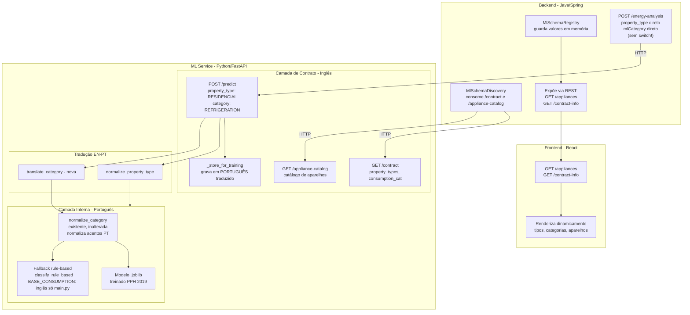

# ADR-0028: Complemento ao Contrato em Inglês - Fronteira entre API e Processamento Interno do ML Service

## Status

Aceito

## Contexto

O ADR-0027 definiu que o ML Service deve expor endpoints de descoberta (`/contract`,
`/appliance-catalog`) e aceitar apenas valores em inglês nos campos categóricos da
requisição (`property_type`, `highest_consumption_category`), centralizando a tradução
para português internamente.

Durante a análise do código-fonte do ML Service, a equipe de ML apontou três nuances
técnicas importantes que este ADR complementa:

1. A função `normalize_category()` em `features.py` não pode ser modificada porque é
   usada tanto no treino (dados acentuados em português) quanto na inferência
   (via `sklearn Pipeline`). A solução é **adicionar** uma função de tradução separada,
   não modificar a existente.
2. O dicionário `BASE_CONSUMPTION_BY_TYPE` existe em três arquivos (`main.py`,
   `features.py`, `train_model.py`). Apenas a cópia em `main.py` deve mudar para inglês.
3. O log de treinamento (`_store_for_training()`) deve armazenar valores em português
   (traduzidos), não crus em inglês, para manter a compatibilidade com `load_feedback()`
   e o `OneHotEncoder` em `train_model.py`.

Este ADR esclarece a fronteira entre o que é **contrato da API** (inglês, inclusive
os endpoints de descoberta) e o que é **processamento interno do ML Service** (português),
incorporando as correções apontadas pelo time de ML.

## Decisão

A equipe decidiu formalizar a separação entre **camada de contrato** (inglês) e **camada
de processamento interno** (português) do ML Service, documentando que o backend nunca
precisa conhecer os detalhes internos do ML. A tradução EN->PT é uma responsabilidade
exclusiva do ML Service.

### 1. Fluxo completo de ponta a ponta

### 2. `BASE_CONSUMPTION_BY_TYPE` em três arquivos, apenas um muda

O dicionário `BASE_CONSUMPTION_BY_TYPE` está presente em três arquivos, cada um com um
propósito diferente:

| Arquivo | Uso | Deve mudar para inglês? | Motivo |
|---|---|---|---|
| `main.py` | `_classify_rule_based()` - fallback da API | **Sim** | Recebe `data.property_type` cru da requisição, agora em inglês |
| `features.py` | Definido mas não usado (código usa `500.0` hardcoded) | **Não** | Nunca acessado com o valor cru da requisição |
| `train_model.py` | Geração de dados sintéticos e cálculo de ineficiência | **Não** | Usado internamente, nunca recebe dados do backend |

### 3. Por que `normalize_category()` não é modificada

A função normaliza variações de acentuação em português (`"Refrigeração"` ->
`"Refrigeracao"`). Ela é usada em dois contextos:

1. **Treino:** Dados do CSV chegam acentuados; `normalize_category()` remove acentos
   para o `OneHotEncoder`.
2. **Inferência:** O `sklearn Pipeline` carregado do `.joblib` executa
   `feature_engineering()` automaticamente em toda chamada de `predict()`.

Se reescrita para mapear inglês -> português, quebraria ambos os fluxos. A solução é
criar `translate_category()` como função separada, chamada antes do pipeline.

### 4. `_run_prediction()` aplica `translate_category()` antes do modelo

O método `_run_prediction()` recebe `highest_consumption_category` em inglês
(ex: `"REFRIGERATION"`) e precisa aplicar `translate_category()` antes de construir
o DataFrame para o modelo ou pipeline sklearn. Isso garante que o modelo (treinado
com `"Refrigeracao"`, `"Climatizacao"`, etc.) receba os valores no formato correto.

### 5. Prompt Groq usa `normalize_property_type()`

O método `_generate_recommendations_groq()` insere `data.property_type` diretamente
no texto do prompt com regras em português (ex: "se for Apartamento, não sugere
painel solar"). `normalize_property_type()` deve ser chamada antes de montar o
prompt para que as regras em português funcionem.

### 6. Por que o log de treinamento registra valores em português

`load_feedback()` em `train_model.py` lê o campo `property_type` do log sem
normalização e passa ao `OneHotEncoder`, que só reconhece categorias em português.
`_store_for_training()` grava valores já traduzidos para garantir compatibilidade.

### 7. Fronteira: o que fica em português vs inglês no ML Service

| Componente | Idioma | Motivo |
|---|---|---|
| **`GET /contract`** | Inglês | Backend descobre tipos/categorias no mesmo idioma que envia |
| **`GET /appliance-catalog`** (nomes) | Português | Substantivos do mundo real, não identificadores de código |
| **`GET /appliance-catalog`** (ml_category) | Inglês | Identificador alinhado ao enum do backend |
| **`POST /predict`** (request) | Inglês | Backend envia valores nativos dos seus enums |
| **`POST /predict`** (response) | Inglês | Categoria de eficiência e origem em inglês |
| **`normalize_property_type()`** | EN->PT | Ponte entre o contrato (inglês) e o modelo (português) |
| **`translate_category()`** | EN->PT | Ponte entre o contrato (inglês) e o modelo (português) |
| **`normalize_category()`** (existente) | PT->PT (acentos) | Não modificada - usada no treino e pipeline |
| **`BASE_CONSUMPTION_BY_TYPE` em `main.py`** | Inglês | Acessado com `data.property_type` cru (agora inglês) |
| **`BASE_CONSUMPTION_BY_TYPE` em `features.py` e `train_model.py`** | Português | Inalterados (nunca recebem dados da API) |
| **Modelo ML (.joblib)** | Português | Treinado com dados PPH 2019 |
| **Log de treinamento (`_store_for_training`)** | Português (traduzido) | Compatibilidade com `load_feedback()` + `OneHotEncoder` |
| **Recomendações (Groq/rule-based)** | Português | Saída exibida ao usuário final |

### 8. O backend nunca precisa saber disso

O backend se relaciona apenas com a **camada de contrato** do ML Service: endpoints
`GET /contract`, `GET /appliance-catalog`, `POST /predict`. Tudo em inglês. O backend
não precisa saber que internamente o ML traduz para português, mantém
`normalize_category()` intacta, só alterou `BASE_CONSUMPTION_BY_TYPE` no `main.py`,
ou armazena o log em português.

Isso é o objetivo do ADR-0027: **o ML Service é o único ponto de normalização
linguística**, e as demais camadas descobrem e enviam dados no idioma do contrato.

### 9. Validação técnica da equipe de ML

As alterações foram validadas pela equipe de ML (Guilherme Hermano), que confirmou
que:

1. `normalize_category()` em `features.py` **não pode ser modificada** — a abordagem
   de criar `translate_category()` separada é a correta.
2. `normalize_property_type()` deve ser aplicada em **três pontos**: pipeline de
   predição, `_store_for_training()` e prompt da Groq.
3. `translate_category()` deve ser aplicada em `_run_prediction()` (antes do modelo)
   e `_store_for_training()`.
4. Apenas a cópia de `main.py` do `BASE_CONSUMPTION_BY_TYPE` muda para inglês.

## Alternativas consideradas

| Alternativa | Prós | Contras |
|---|---|---|
| **Documentar fronteira contrato vs interno (escolhido)** | Elimina dúvidas sobre o idioma de cada componente | Nenhuma - é apenas documentação complementar |
| **Modificar `normalize_category()` (rejeitado)** | Reaproveita função existente | Quebra o treino; quebra o pipeline na inferência |
| **Não documentar a fronteira** | Nenhum esforço adicional | Dúvidas continuariam surgindo |

## Consequências

- **Positivo:** Fica claro que o backend nunca precisa conhecer os detalhes internos
  do ML Service.
- **Positivo:** `normalize_category()` não é modificada, preservando o treino.
- **Positivo:** `translate_category()` é uma adição segura sem afetar fluxo existente.
- **Positivo:** Apenas a cópia de `main.py` do `BASE_CONSUMPTION_BY_TYPE` muda para
  inglês. As demais não são afetadas.
- **Positivo:** Log de treinamento em português mantém `load_feedback()` funcional.
- **Positivo:** Tabela de fronteira (seção 5) serve como referência para toda a equipe.
- **Negativo:** Documento complementar precisa ser mantido se a arquitetura mudar.
- **Negativo:** ML Service ganha função `translate_category()` (~15 linhas), impacto
  desprezível.

> **Nota:** Consulte o [glossário do projeto](../glossario.md) para definição dos termos
> utilizados neste documento.
