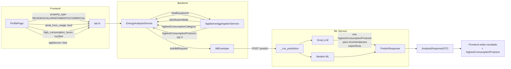

# ADR-0032: Enriquecimento de Dados da Análise Energética

## Status

Aceito

## Contexto

A análise energética atual envia ao ML Service os campos obrigatórios definidos
no contrato (`consumption_kwh`, `peak_hour_usage`, `equipment_quantity`,
`property_type`, `high_consumption_hours`, `highest_consumption_category`,
`daily_consumption_distribution`), mas existem oportunidades de melhoria para
tornar a classificação e as recomendações mais precisas.

Três gaps foram identificados:

1. **Tipo de imóvel limitado a 2 opções**: O frontend oferece apenas
   `RESIDENCIAL` e `COMERCIAL`, enquanto o ML Service reconhece 3 tipos:
   `"Casa"`, `"Apartamento"`, `"Comercial"`. Usuários de apartamento são
   classificados como `"Casa"`, o que reduz a precisão da análise (o consumo
   base de um apartamento é 150 kWh, contra 250 kWh de uma casa).

2. **ProfilePage não captura `peak_hour_usage` e `high_consumption_hours`**:
   O AnalysisForm (Home) permite que o usuário informe esses campos manualmente,
   mas o ProfilePage usa valores inferidos de forma genérica:
   `peakHourUsage = (propertyType === "COMERCIAL")` e
   `highConsumptionHours = Math.round(consumptionKwh / 100)`.
   Isso faz com que a análise pelo perfil seja menos precisa que a análise
   rápida pela Home.

3. **`highest_consumption_products` nunca é enviado ao ML Service**: O contrato
   do ML Service (ADR-0026) define o campo `highest_consumption_products` como
   uma lista dos 3 aparelhos de maior consumo do imóvel. Esse campo é usado
   como contexto para o LLM gerar recomendações mais específicas (ex.:
   "sua geladeira consome 150W - evite colocá-la perto do fogão"). Atualmente
   o backend não calcula nem envia esse campo.

Além disso, há três tarefas futuras registradas que dependem das implementações
acima ou do time de ML Service:

1. **Revisar mapeamento de categorias para distribuição de potência**: O
   `ApplianceAggregationService` mapeia categorias de aparelhos para buckets
   de distribuição (refrigeration_watts, heating_watts, etc.). Algumas
   categorias como "Tecnologia" e "Servicos" podem não ter distribuição definida.

2. **Usar `highest_consumption_products` no prompt do LLM**: Após o backend
   passar a enviar o campo, o ML Service pode incorporá-lo no prompt do Groq
   para recomendações citando equipamentos específicos.

3. **Exibir `highest_consumption_products` no frontend**: Mostrar ao usuário
   quais foram os aparelhos de maior consumo identificados na análise.

## Decisão

Implementar as melhorias em duas rodadas:

### Rodada 1 - Imediata (backend + frontend, sem alterar ML Service)

| ID | Título | Descrição |
|---|---|---|
| F046 | ProfilePage: adicionar campos `peakHourUsage` e `highConsumptionHours` | Adicionar checkbox e input numérico no formulário do ProfilePage, substituindo inferências genéricas |
| F047 | Adicionar "Apartamento" como tipo de imóvel | Incluir `APARTAMENTO` em `PROPERTY_TYPES` no frontend e mapear para `"Apartamento"` no backend |
| B039 | Calcular e enviar `highest_consumption_products` ao ML Service | Calcular top 3 aparelhos por consumo mensal no `ApplianceAggregationService` e incluir no `MlEnvelope` |

### Rodada 2 - Futura (depende de implementações da Rodada 1 ou time ML)

| ID | Título | Descrição |
|---|---|---|
| B040 | Revisar mapeamento de categorias para distribuição de potência | Garantir que toda categoria de aparelho tenha um bucket de distribuição associado |
| B041 | Usar `highest_consumption_products` no prompt do LLM | Incorporar no prompt do Groq para recomendações específicas |
| F048 | Exibir `highest_consumption_products` no resultado da análise | Mostrar ao usuário os 3 aparelhos de maior consumo |

### Diagrama do fluxo de dados após as melhorias

## Alternativas consideradas

| Alternativa | Prós | Contras |
|---|---|---|
| **Manter 2 tipos de imóvel (atual)** | Sem alterações no frontend | Precisão reduzida para apartamentos |
| **Adicionar Apartamento (escolhido)** | 3 tipos alinhados com o ML Service | Requer ajuste no frontend, backend e PropertyType |
| **Calcular highestConsumptionProducts só no backend (escolhido)** | Sem alteração na API do ML Service | Dado pode divergir do cálculo do ML |
| **Calcular highestConsumptionProducts no ML Service** | Alinhado com o dataset de treino | Exige alteração no ML Service |

## Consequências

- **Positivo:** Análise mais precisa, especialmente para usuários de apartamento
- **Positivo:** Recomendações do LLM poderão citar equipamentos específicos
- **Positivo:** ProfilePage terá os mesmos campos que o AnalysisForm
- **Negativo:** Requer alterações em 3 camadas (frontend, backend, schema de dados)
- **Negativo:** Usuários existentes com `RESIDENCIAL` precisarão revisar o tipo
