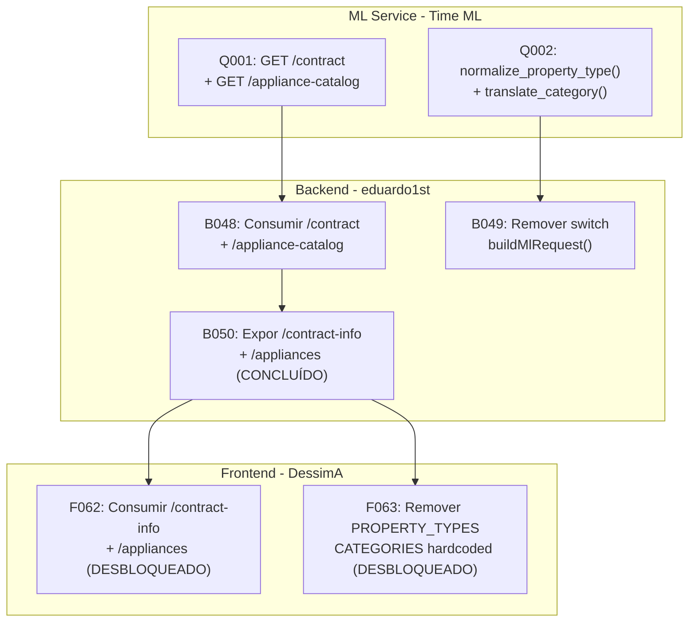

# ADR-0044: Impacto das Tasks Concluídas nas ADRs 27 e 28 e Fluxo de Dependências Atualizado

## Status

Aceito

## Contexto

As ADRs 0027 e 0028 foram aprovadas e definem:

1. ML Service deve expor endpoints de descoberta (`/contract`, `/appliance-catalog`) e aceitar valores em inglês nos campos categóricos, traduzindo internamente para português.
2. Backend deve consumir esses endpoints e eliminar o switch de tradução.
3. Frontend deve consumir do backend dinamicamente, eliminando dados hardcoded.

Desde que essas ADRs foram propostas, outras tasks foram concluídas que impactam parcialmente o escopo das ADRs 27 e 28. Este ADR documenta:

- O que já foi implementado e como reduz o escopo das tasks pendentes.
- O que pode ser feito agora.
- O que continua bloqueado pelo ML Service.
- O fluxo de dependências atualizado entre as camadas.

## Decisão

A equipe decidiu documentar formalmente o estado atual de cada task das ADRs 27 e 28, separando o que já foi avançado por outras tasks do que ainda precisa ser implementado, e atualizando o fluxo de dependências.

### 1. Tasks concluídas que já avançaram parcialmente as ADRs 27 e 28

| Task concluída | O que fez | Impacto na ADR 27/28 |
|---|---|---|
| **F054** - Mapeamento `EquipmentCategory` | Adicionou `SERVICES` ao enum do backend + `CATEGORIES` e `CATEGORY_ORDER` no frontend | As categorias foram atualizadas manualmente, mas continuam hardcoded. |
| **B038** - Snapshot de equipamentos | Backend salva e retorna `appliances` com `category`, `name`, `monthly_consumption_kwh` | O DTO de resposta já suporta dados por equipamento, facilitando as tasks F064 e F065. |
| **F058** - Alinhamento FE/BE | Removeu `AnalysisForm.tsx`, expôs `highestConsumptionProducts`, Dashboard usa `/simulate` real | Redução de código morto e alinhamento de contrato. |
| **F049** - Remover localStorage | Preferências agora salvam via backend | Frontend deixou de ser source of truth. |
| **F034** - Remover `APPLIANCE_FALLBACK` | Catálogo de aparelhos agora vem do backend via `GET /appliances` | Dados vêm do backend. |
| **B050** - Expor `/contract-info` e `/appliances` dinâmicos | Backend expõe endpoints consumindo dados do `MlSchemaRegistry` | Backend agora expõe com sucesso os dados descobertos do ML, permitindo consumo dinâmico. |

### 2. O que pode ser feito agora (sem depender do ML Service)

| Task | O que fazer | Por que pode começar |
|---|---|---|
| **F062** (completo) | Consumir `GET /appliances` e `/contract-info` confiando 100% no backend, removendo dados locais estáticos | O endpoint B050 já foi concluído e está operacional no backend. |
| **F063** (completo) | Consumir os endpoints dinâmicos em vez de `CATEGORIES` e `CATEGORY_ORDER` hardcoded | Os dados já são expostos dinamicamente pelo backend. |
| **F065** (início) | Começar a usar `mlCategory` como identificador interno, mantendo português só na exibição | Independe do ML - é refatoração interna do frontend. |

### 3. O que continua bloqueado pelo ML Service

| Task | Depende de | Motivo do bloqueio |
|---|---|---|
| **B048** - Consumir `/contract` e `/appliance-catalog` | Q001: endpoints no ML | Os endpoints precisam existir no ML primeiro. |
| **B049** - Remover switch `RESIDENCIAL → "Casa"` | Q002: ML aceitar inglês | Backend só pode remover o switch depois que o ML passar a aceitar inglês. |

### 4. Fluxo de dependências atualizado

### 5. Cards do ML Service

| ID | Título |
|---|---|
| Q001 | Endpoints de descoberta: GET /contract e GET /appliance-catalog |
| Q002 | Funções de normalização EN->PT (`normalize_property_type` + `translate_category`) |

### 6. Tasks recomendadas para execução imediata

| Ordem | Task | Descrição |
|---|---|---|
| 1 | F062 | Consumir os endpoints dinâmicos recém-criados no backend (/contract-info e /appliances) |
| 2 | F063 | Remover completamente PROPERTY_TYPES e CATEGORIES hardcoded do frontend |
| 3 | F065 | Refatorar identificadores internos para usar mlCategory em inglês |

### Consequências

- **Positivo**: A conclusão da B050 desbloqueia diretamente as tarefas de integração no frontend F062 e F063.
- **Positivo**: Clareza total para a equipe sobre o escopo restante.
