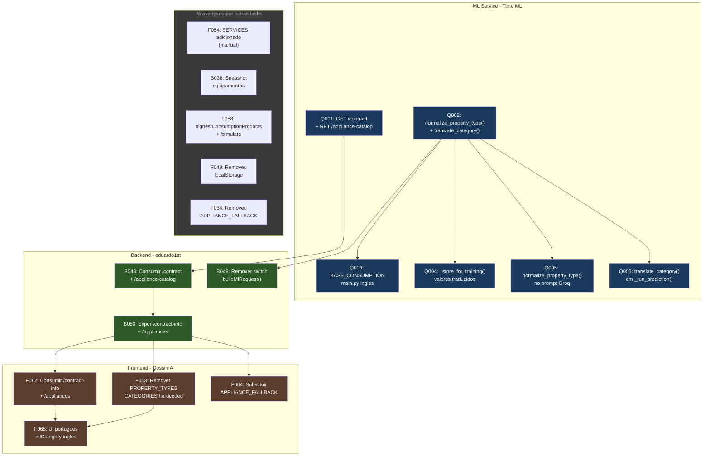

# ADR-0044: Impacto das Tasks Concluídas nas ADRs 27 e 28 e Fluxo de Dependências Atualizado

## Status

Proposto

## Contexto

As ADRs 0027 e 0028 foram aprovadas e definem:

1. ML Service deve expor endpoints de descoberta (`/contract`, `/appliance-catalog`) e
   aceitar valores em inglês nos campos categóricos, traduzindo internamente para português.
2. Backend deve consumir esses endpoints e eliminar o switch de tradução.
3. Frontend deve consumir do backend dinamicamente, eliminando dados hardcoded.

Desde que essas ADRs foram propostas, outras tasks foram concluídas que impactam
parcialmente o escopo das ADRs 27 e 28. Este ADR documenta:

- O que já foi implementado e como reduz o escopo das tasks pendentes.
- O que pode ser feito agora sem depender do ML Service.
- O que continua bloqueado pelo ML Service.
- O fluxo de dependências atualizado entre as camadas.

## Decisão

A equipe decidiu documentar formalmente o estado atual de cada task das ADRs 27 e 28,
separando o que já foi avançado por outras tasks do que ainda precisa ser implementado,
e atualizando o fluxo de dependências.

### 1. Tasks concluídas que já avançaram parcialmente as ADRs 27 e 28

| Task concluída | O que fez | Impacto na ADR 27/28 |
|---|---|---|
| **F054** — Mapeamento `EquipmentCategory` | Adicionou `SERVICES` ao enum do backend + `CATEGORIES` e `CATEGORY_ORDER` no frontend | As categorias foram atualizadas manualmente, mas continuam hardcoded. Se o ML adicionar `HEATING`, ainda precisa de alteração manual |
| **B038** — Snapshot de equipamentos | Backend salva e retorna `appliances` com `category`, `name`, `monthly_consumption_kwh` | O DTO de resposta já suporta dados por equipamento, facilitando as tasks F064 e F065 |
| **F058** — Alinhamento FE/BE | Removeu `AnalysisForm.tsx`, expôs `highestConsumptionProducts`, Dashboard usa `/simulate` real | Redução de código morto e alinhamento de contrato, sem alterar o problema de descoberta dinâmica |
| **F049** — Remover localStorage | Preferências agora salvam via backend | Frontend deixou de ser source of truth, alinhado ao conceito das ADRs |
| **F034** — Remover `APPLIANCE_FALLBACK` | Catálogo de aparelhos agora vem do backend via `GET /appliances` | Dados vêm do backend, mas o backend ainda serve dados fixos (não do ML) |

### 2. O que pode ser feito agora (sem depender do ML Service)

Mesmo com as tasks do ML Service (Q001-Q006) pendentes, há trabalho que pode começar:

| Task | O que fazer | Por que pode começar |
|---|---|---|
| **F062** (parcial) | Consumir `GET /appliances` confiando 100% no backend, remover `METADATA_BY_NAME` local | O endpoint já existe e funciona, só precisa eliminar o fallback local |
| **F063** (parcial) | Consumir `/energy-analysis/categories` (já existe!) em vez de `CATEGORIES` e `CATEGORY_ORDER` hardcoded no `ProfilePage.tsx` | O backend já expõe as categorias — o frontend só não usa |
| **F065** (início) | Começar a usar `mlCategory` como identificador interno, mantendo português só na exibição para o usuário | Independe do ML — é refatoração interna do frontend |

### 3. O que continua bloqueado pelo ML Service

| Task | Depende de | Motivo do bloqueio |
|---|---|---|
| **B048** — Consumir `/contract` e `/appliance-catalog` | Q001 (endpoints no ML) | Os endpoints precisam existir no ML primeiro |
| **B049** — Remover switch `RESIDENCIAL → "Casa"` | Q002 (ML aceitar inglês) | Backend só pode remover o switch depois que o ML passar a aceitar inglês |
| **B050** — Expor `/contract-info` e `/appliances` dinâmicos | B048 | Backend precisa primeiro consumir os dados do ML |
| **F062** (completo) — Consumir dados dinâmicos do ML | B050 | Frontend precisa do backend expondo os dados descobertos |
| **F063** (completo) — Remover hardcoded total | B050 + F062 | Dados dinâmicos completos só chegam após B050 |

### 4. Fluxo de dependências atualizado

### 5. Cards do ML Service

Os cards do ML Service utilizam o prefixo Q (ML Service) para diferenciar de cards
de banco de dados (M):

| ID | Título |
|---|---|
| Q001 | Endpoints de descoberta: GET /contract e GET /appliance-catalog |
| Q002 | Funções de normalização EN->PT (normalize_property_type + translate_category) |
| Q003 | Ajustar BASE_CONSUMPTION_BY_TYPE em main.py para inglês |
| Q004 | Atualizar _store_for_training() para gravar valores traduzidos |
| Q005 | Aplicar normalize_property_type() no prompt da Groq |
| Q006 | Aplicar translate_category() em _run_prediction() |

### 6. Tasks que podem ser executadas imediatamente

| Ordem | Task | Descrição |
|---|---|---|
| 1 | **F063 parcial** | Substituir `CATEGORIES` e `CATEGORY_ORDER` hardcoded em `ProfilePage.tsx` pelo retorno de `/energy-analysis/categories` |
| 2 | **F062 parcial** | Remover dependência de `METADATA_BY_NAME` em `appliances.ts`, confiando apenas no que o backend retorna |
| 3 | **F065 início** | Refatorar identificadores internos para usar `mlCategory` em inglês, mantendo português apenas na exibição |

## Alternativas consideradas

| Alternativa | Prós | Contras |
|---|---|---|
| **Documentar estado atual + o que pode adiantar (escolhido)** | Clareza para a equipe; tasks desbloqueadas imediatamente | Documento precisa ser atualizado se prioridades mudarem |
| **Aguardar ML Service para começar tudo** | Fluxo linear simples | Frontend e backend ficam ociosos |
| **Ignorar o que já foi feito** | Nenhum esforço de documentação | Tasks podem parecer maiores do que realmente são |

## Consequências

- **Positivo:** Frontend pode começar 3 tasks imediatamente sem depender do ML.
- **Positivo:** Fica claro para a equipe o que já foi avançado por outras tasks.
- **Positivo:** Fluxo de dependências atualizado evita retrabalho.
- **Positivo:** Prefixo Q para ML Service evita confusão com cards de banco de dados (M).
- **Negativo:** Documento precisa ser atualizado conforme as tasks progridem.

> **Nota:** Consulte as [ADRs 0027](0027-contrato-bilingue-ml-service.md) e [0028](0028-fronteira-contrato-processamento-ml.md)
> para o contexto completo das decisões de arquitetura.
