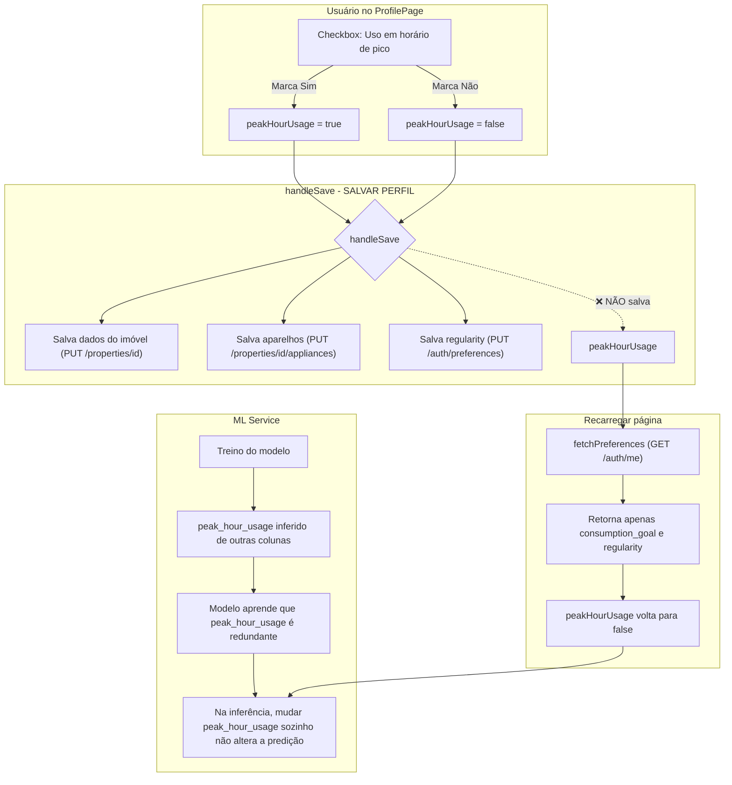
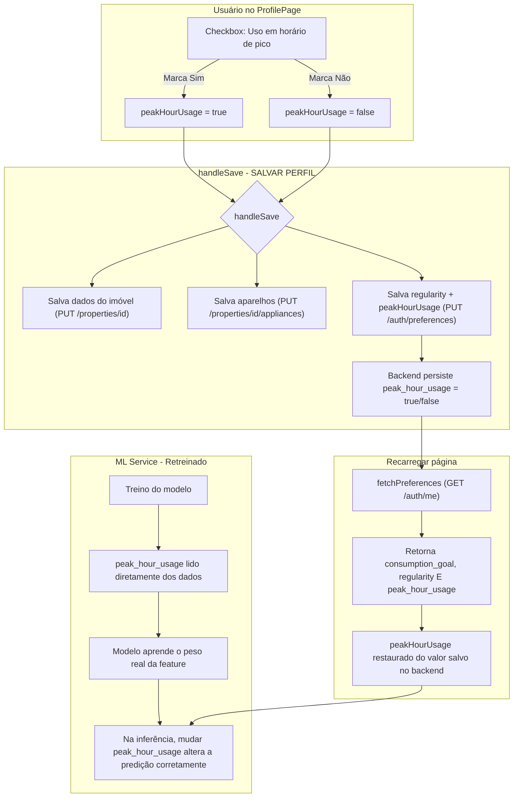

# ADR-0046: Persistência e Independência do peak_hour_usage

## Status

Aceito

> **Nota (Agosto/2026):** A Decisão A (persistência no Backend e Frontend) foi totalmente
> implementada. O backend através da Task **B051** (migration V15 adicionou `peak_hour_usage`
> boolean e `high_consumption_hours` numeric; a API expõe e persiste esses valores
> corretamente) e o frontend através da Task **F069**, que passou a enviar
> `peak_hour_usage`/`high_consumption_hours` no `PUT /auth/preferences` (handleSave) e a
> restaurá-los via `GET /auth/me` (fetchPreferences). A validação do frontend foi concluída em
> 01/08/2026: 2 testes E2E novos (persistência no save + recarga refletindo o valor salvo), 6
> testes unitários novos em `api.test.ts` e suíte E2E completa 71/71 (Firefox). A Decisão B
> (retreino do ML, Q008) segue pendente pela equipe de Dados.

## Contexto

Durante a investigação de um bug reportado pelo usuário (marcar "Sim" ou "Não"
para uso em horário de pico das 18h às 21h resultava na mesma classificação de
eficiência energética), a equipe identificou dois problemas independentes no
fluxo end-to-end do campo `peak_hour_usage`:

### Problema A: `peak_hour_usage` não é persistido no perfil do usuário

O frontend (`ProfilePage.tsx`) possui um checkbox "Uso em horário de pico (18h às 21h)" que controla o estado `peakHourUsage`. No entanto:

1. A função `handleSave()` não envia `peakHourUsage` para nenhum endpoint da API: ela salva apenas dados da propriedade, aparelhos e `regularity`.

2. A função `fetchPreferences()` retorna apenas `consumption_goal` e `regularity`, sem incluir `peak_hour_usage`.

3. O backend não possui um endpoint ou campo para persistir `peak_hour_usage` como preferência do usuário.

**Impacto:** Toda vez que a página recarrega, `peakHourUsage` volta para `false`. O usuário precisa lembrar de marcar manualmente antes de cada análise.

### Problema B: Modelo de ML trata `peak_hour_usage` como feature inferida, não independente

Durante o treinamento do modelo (`train_model.py`), a coluna `peak_hour_usage` é **inferida** a partir de outras colunas de hábitos de consumo:

```python
# train_model.py:326
df["peak_hour_usage"] = df.apply(_infer_peak_usage, axis=1)
```

Isso significa que, no conjunto de treino, `peak_hour_usage` é altamente correlacionado com
`consumption_kwh`, `high_consumption_hours` e outras features. Consequentemente, o modelo
RandomForest aprendeu que `peak_hour_usage` não adiciona informação independente. Por isso, na
inferência, alterar apenas este campo não muda a predição do modelo quando a confiança é alta
(>80%).

Já na classificação rule-based (fallback quando o modelo não está disponível), `peak_hour_usage` contribui com 25% do índice:

```python
índice = 0.40 * consumo + 0.25 * pico_norm + 0.20 * equip + 0.15 * horas
```

Neste caso, alterar `peak_hour_usage` de `false` para `true` adiciona 0.25 ao índice, o que é suficiente para mudar a categoria na maioria dos cenários.

### Fluxo Atual (Com Problemas)



## Decisão

### Decisão A (Frontend + Backend): Persistir `peak_hour_usage` no perfil do usuário

A equipe decidiu adicionar `peak_hour_usage` como um campo persistente nas preferências do usuário, seguindo o mesmo padrão já existente para `regularity` e `consumption_goal`:

1. **Backend:** Adicionar campo `peak_hour_usage` (booleano) ao endpoint `PUT /auth/preferences` e ao retorno de `GET /auth/me`

2. **Frontend:** Incluir `peakHourUsage` no corpo de `updatePreferences()` e lê-lo em `fetchPreferences()`

3. **`handleSave()`:** Enviar `peakHourUsage` para `updatePreferences()` juntamente com `regularity`

**Status da Implementação (Task B051 - Concluída):**O backend foi atualizado com sucesso. Além do `peak_hour_usage`, o campo `high_consumption_hours` também foi exposto nas preferências. Ambos os campos trafegam na API em formato `snake_case` e são persistidos de forma segura no banco de dados, destravando o fluxo do frontend.

### Decisão B (ML Service): Tornar `peak_hour_usage` uma feature independente no treino

A equipe de ML deve re-treinar o modelo tratando `peak_hour_usage` como um campo lido diretamente dos dados, e não inferido a partir de outras colunas. As opções avaliadas foram:

1. **Usar dados reais de `peak_hour_usage`:** Se houver dados coletados de usuários reais com o campo preenchido manualmente, usá-los diretamente no treino.
2. **Remover a inferência e usar valor aleatório controlado:** Gerar `peak_hour_usage` com uma distribuição conhecida (ex: 40% sim, 60% não) para que o modelo aprenda o peso real da feature.
3. **Forçar o uso da regra `_classify_rule_based()`:** alternativa temporária enquanto o modelo não é retreinado, usando a classificação rule-based para análises com `peak_hour_usage`.

**Decisão:** A equipe optou pela **opção 2 (valor aleatório controlado)** como solução de curto prazo, com a **opção 1 (dados reais)** como meta de longo prazo, aguardando coleta de dados de usuários reais.

### Fluxo Corrigido (Solução)



## Alternativas consideradas

| Alternativa | Prós | Contras |
| --- | --- | --- |
| **A: Persistir peak_hour_usage no backend** | Dados persistem entre sessões; usuário não precisa reconfigurar | Requer mudança no backend e frontend |
| **A: Manter apenas no frontend (localStorage)** | Sem mudança no backend | Não sincroniza entre dispositivos; não fica no histórico |
| **B: Inferir peak_hour_usage no treino (atual)** | Simples; dados sintéticos consistentes | Modelo ignora o campo na inferência; bug reportado pelo usuário |
| **B: Remover inferência, ler diretamente** | Feature independente; modelo respeita o valor enviado | Requer retreino; dados reais podem ser escassos |
| **B: Fallback forçado para rule-based** | Resolve imediatamente sem retreino | Perde qualidade do modelo ML para outros cenários |

## Consequências

- **Positivo:** Usuário pode configurar `peak_hour_usage` uma vez e ele persistir entre sessões

- **Positivo:** Análises subsequentes refletirão corretamente a escolha do usuário

- **Positivo:** Feature engineering do modelo ML passa a tratar `peak_hour_usage` como dado real, não inferido

- **Positivo:** A migração de banco de dados (V15) foi executada de forma segura e já comporta as novas preferências.

- **Negativo:** ML Service precisa de retreino do modelo (ciclo de ~30 min)

- **Neutro:** Análises existentes no histórico mantêm o `peak_hour_usage` que foi enviado na época

> **Nota:** Consulte o [glossário do projeto](../glossario.md) para definição dos termos utilizados neste documento.
