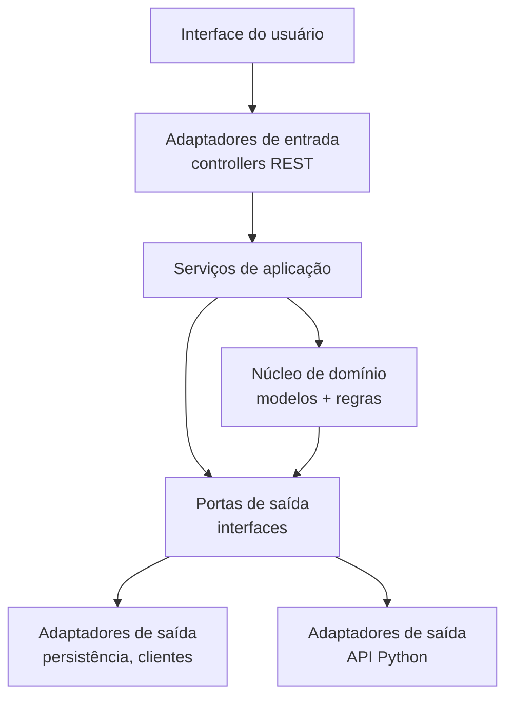

# Arquitetura hexagonal (Ports and Adapters)

Descrição do padrão de arquitetura adotado pelo projeto EnergiIA, com seus princípios, estrutura de diretórios e diretrizes de desenvolvimento.

## Visão geral

O projeto EnergiIA adota a **Arquitetura Hexagonal**, baseada no padrão Ports and Adapters. O objetivo central é garantir o **desacoplamento absoluto** entre as regras de negócio (domínio) e as dependências tecnológicas externas (frameworks, banco de dados, interfaces de usuário e APIs externas).

Esse isolamento é alcançado através do princípio da **Inversão de Dependência**: todas as dependências sistêmicas apontam para o centro da aplicação. A camada de domínio não possui referências a bibliotecas de infraestrutura, garantindo alta testabilidade e facilidade de manutenção.

## Estrutura de diretórios

A arquitetura está segmentada em três camadas: `core`, `application` e `infrastructure`.

### Camada `core`

Representa o núcleo da aplicação. Contém estritamente código Java padrão. Nenhuma anotação de framework (como Spring Web ou JPA) é permitida.

| Pacote | Responsabilidade |
|---|---|
| `domain/model` | Entidades de domínio ricas que encapsulam atributos, regras de negócio estruturais e invariantes |
| `domain/exceptions` | Exceções específicas do domínio para sinalizar violações de regras sem depender de classes HTTP ou banco |
| `ports/in` | Portas de entrada (Driving Ports) que definem casos de uso expostos pela aplicação |
| `ports/out` | Portas de saída (Driven Ports) que definem contratos de infraestrutura necessários ao domínio |

### Camada `application`

Atua como a camada de orquestração de casos de uso e fluxo de controle.

| Pacote | Responsabilidade |
|---|---|
| `services` | Implementa as interfaces de `ports/in`, orquestra a execução: recupera dados, delega regras ao domínio e persiste resultados |

### Camada `infrastructure`

Camada mais externa, responsável por integrar o núcleo com tecnologias, frameworks e protocolos de comunicação.

| Pacote | Responsabilidade |
|---|---|
| `adapters/in/web/controllers` | Endpoints REST que interceptam requisições HTTP e delegam à camada de serviços |
| `adapters/in/web/dto` | Data Transfer Objects para padronizar contratos de entrada e saída (JSON) |
| `adapters/in/web/mapper` | Conversão bidirecional entre DTOs e entidades de domínio |
| `adapters/out/persistence/entity` | Classes de persistência mapeadas com anotações JPA |
| `adapters/out/persistence/repository` | Interfaces Spring Data JPA |
| `adapters/out/persistence/adapter` | Implementação das portas de saída de persistência |
| `adapters/out/persistence/mapper` | Conversão entre entidades JPA e domínio |
| `adapters/out/client/python` | Comunicação HTTP com o modelo preditivo de IA |
| `config` | Parametrizações: handlers globais de exceção, beans do core, CORS |

## Diretrizes práticas

### Restrição de dependência

O fluxo de controle nas portas de saída sofre inversão. A camada `infrastructure` importa as definições do `core`. O `core` jamais importa pacotes de `infrastructure`.

### Isolamento tecnológico

Modificações no banco de dados, atualizações de framework ou alterações de contrato na API Python devem impactar única e exclusivamente a camada `infrastructure`.

### Separação de validações

| Tipo de validação | Onde ocorre | Tecnologia |
|---|---|---|
| Validações sintáticas (tipagem, campos nulos, formatação) | Camada web | Bean Validation nos DTOs |
| Validações semânticas e lógicas de negócio | Domínio | Classes em `domain/model` |

> **Nota:** Consulte o [diagrama de arquitetura do projeto](./arquitetura.md) para a estrutura completa de diretórios,
> a [documentação de dependências](./dependency-doc.md) para detalhes das bibliotecas utilizadas, o
> [contrato de API](./contrato-api.md) para a definição dos endpoints e o [glossário do projeto](./glossario.md)
> para definição dos termos de domínio.
