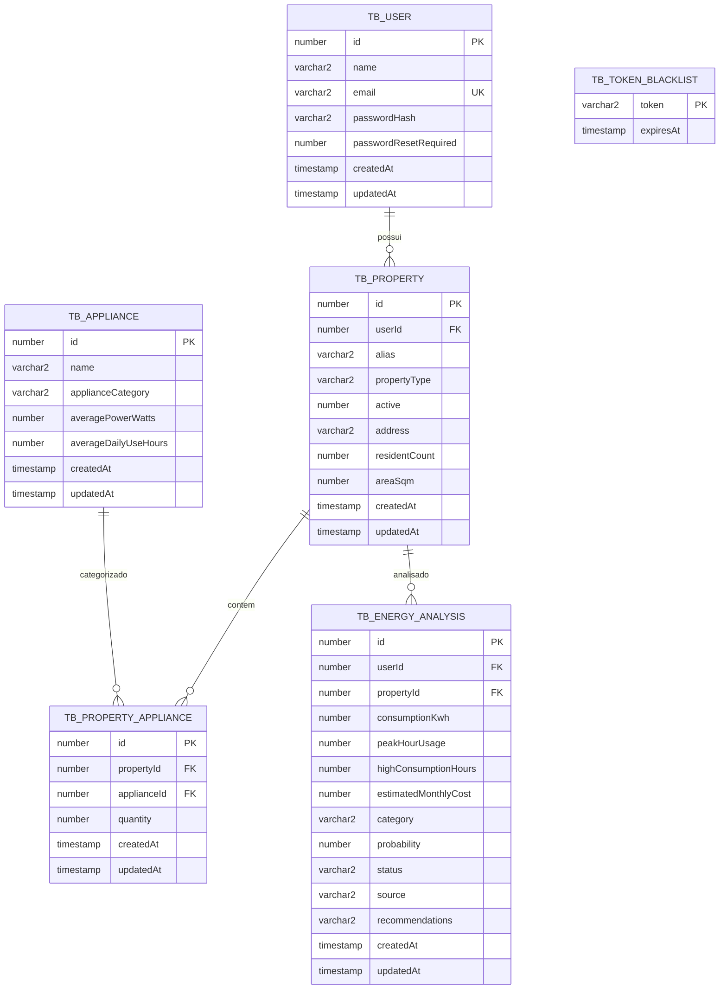

# Banco de Dados - Esquema e Migrações

Documentação das tabelas, relacionamentos e migrations do banco Oracle ATP.

## Índice

- [Visão Geral](#visão-geral)
- [Diagrama de Entidades](#diagrama-de-entidades)
- [Tabelas](#tabelas)
- [Migrações (Flyway)](#migrações-flyway)
- [Índices e Constraints](#índices-e-constraints)

---

## Visão Geral

O banco de dados Oracle ATP armazena usuários, imóveis, aparelhos, análises energéticas e tokens invalidados. As migrations são gerenciadas pelo Flyway e estão em `backend/src/main/resources/db/migration/oracle/`.

## Diagrama de Entidades

## Tabelas

### TB_USER

| Coluna | Tipo | Restrições | Descrição |
|---|---|---|---|
| id | NUMBER | PK, gerado por sequence | Identificador único |
| name | VARCHAR2(255) | NOT NULL | Nome do usuário |
| email | VARCHAR2(255) | NOT NULL, UNIQUE | E-mail de login |
| password_hash | VARCHAR2(255) | NOT NULL | Hash BCrypt (ou SHA-256 legado) |
| password_reset_required | NUMBER(1,0) | DEFAULT 0 | Flag para forçar redefinição de senha pelo admin |
| created_at | TIMESTAMP | NOT NULL | Data de criação |
| updated_at | TIMESTAMP | NOT NULL | Data de atualização |

### TB_PROPERTY

| Coluna | Tipo | Restrições | Descrição |
|---|---|---|---|
| id | NUMBER | PK | Identificador único |
| user_id | NUMBER | FK → TB_USER.id | Proprietário do imóvel |
| alias | VARCHAR2(100) | NOT NULL | Nome do imóvel (ex: "Minha Casa") |
| property_type | VARCHAR2(50) | NOT NULL | Tipo: RESIDENCIAL, COMERCIAL |
| active | NUMBER(1,0) | DEFAULT 1 | Se o imóvel está ativo |
| address | VARCHAR2(255) | NULLABLE | Endereço do imóvel |
| resident_count | NUMBER | NULLABLE | Número de moradores |
| area_sqm | NUMBER | NULLABLE | Área em metros quadrados |
| created_at | TIMESTAMP | NOT NULL | Data de criação |
| updated_at | TIMESTAMP | NOT NULL | Data de atualização |

### TB_APPLIANCE

| Coluna | Tipo | Restrições | Descrição |
|---|---|---|---|
| id | NUMBER | PK | Identificador único |
| name | VARCHAR2(100) | NOT NULL | Nome do aparelho |
| appliance_category | VARCHAR2(50) | NOT NULL | Categoria (REFRIGERACAO, CLIMATIZACAO, ILUMINACAO, etc.) |
| average_power_watts | NUMBER | NOT NULL | Potência média em watts |
| average_daily_use_hours | NUMBER | NOT NULL | Horas médias de uso diário |
| created_at | TIMESTAMP | NOT NULL | |
| updated_at | TIMESTAMP | NOT NULL | |

### TB_PROPERTY_APPLIANCE

| Coluna | Tipo | Restrições | Descrição |
|---|---|---|---|
| id | NUMBER | PK | Identificador único |
| property_id | NUMBER | FK → TB_PROPERTY.id | Imóvel |
| appliance_id | NUMBER | FK → TB_APPLIANCE.id | Aparelho |
| quantity | NUMBER(10,0) | NOT NULL | Quantidade do aparelho no imóvel |
| created_at | TIMESTAMP | NOT NULL | |
| updated_at | TIMESTAMP | NOT NULL | |

### TB_ENERGY_ANALYSIS

| Coluna | Tipo | Restrições | Descrição |
|---|---|---|---|
| id | NUMBER | PK | Identificador único |
| user_id | NUMBER | FK → TB_USER.id | Usuário que solicitou |
| property_id | NUMBER | FK → TB_PROPERTY.id | Imóvel analisado |
| consumption_kwh | NUMBER(10,2) | NOT NULL | Consumo informado |
| peak_hour_usage | NUMBER(1,0) | NOT NULL | Uso em horário de pico |
| high_consumption_hours | NUMBER(4,2) | NOT NULL | Horas de alto consumo |
| estimated_monthly_cost | NUMBER(10,2) | NOT NULL | Custo estimado (kWh × tarifa) |
| category | VARCHAR2(20) | NOT NULL | Categoria energética |
| probability | NUMBER(5,4) | NOT NULL | Probabilidade da classificação |
| status | VARCHAR2(20) | NOT NULL | FINALIZADO ou SIMULADO |
| source | VARCHAR2(50) | NOT NULL | Origem: model, model+groq, rule-based |
| recommendations | VARCHAR2(2000) | NOT NULL | Recomendações (texto livre) |
| created_at | TIMESTAMP | NOT NULL | |
| updated_at | TIMESTAMP | NOT NULL | |

### TB_TOKEN_BLACKLIST

| Coluna | Tipo | Restrições | Descrição |
|---|---|---|---|
| token | VARCHAR2(500) | PK | Token JWT invalidado |
| expires_at | TIMESTAMP | NOT NULL | Data de expiração (para limpeza programada) |

## Migrações (Flyway)

As migrações estão em `backend/src/main/resources/db/migration/oracle/`:

| Arquivo | Descrição |
|---|---|
| `V1__initial_schema.sql` | Criação das tabelas: TB_USER, TB_PROPERTY, TB_APPLIANCE, TB_PROPERTY_APPLIANCE, TB_ENERGY_ANALYSIS |
| `V2__insert_appliances.sql` | Popula TB_APPLIANCE com dados residenciais (geladeira, ar-condicionado, chuveiro, etc.) |
| `V3__add_residential_appliances.sql` | Aparelhos adicionais (Air Fryer, Computador, Videogame, etc.) |
| `V4__add_token_blacklist.sql` | Cria TB_TOKEN_BLACKLIST para suporte a logout |
| `V5__force_password_reset.sql` | Adiciona coluna `password_reset_required` em TB_USER |
| `V6__normalize_property_type.sql` | Normaliza os valores de `property_type` na TB_PROPERTY |
| `V7__add_property_fields.sql` | Adiciona colunas `address`, `resident_count`, `area_sqm` em TB_PROPERTY |
| `V8__add_property_fields_2.sql` | Corrige tipos das novas colunas (NUMBER para compatibilidade Oracle) |

## Índices e Constraints

Cada migration adiciona índices apropriados:

- PK em todas as tabelas via sequence Oracle
- FK em TB_PROPERTY (user_id → TB_USER.id), TB_PROPERTY_APPLIANCE (property_id, appliance_id), TB_ENERGY_ANALYSIS (user_id, property_id)
- UNIQUE em TB_USER.email

> **Nota:** Consulte o [guia de execução](./guia-execucao.md) para instruções de configuração do banco e o [ADR-0009](../docs/adr/0009-banco-oracle-e-precisao.md) sobre a decisão de usar Oracle ATP.
