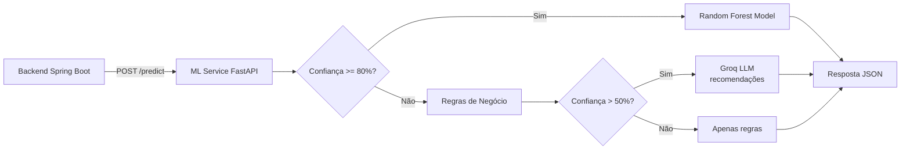

# ML Service - Arquitetura e Modelo de Machine Learning

Documentação do microsserviço Python de classificação energética, endpoints, modelo, treinamento e fallback.

## Índice

- [Stack Tecnológica](#stack-tecnológica)
- [Arquitetura](#arquitetura)
- [Modelo de Machine Learning](#modelo-de-machine-learning)
- [Fallback Rule-Based](#fallback-rule-based)
- [Fallback Groq (LLM)](#fallback-groq-llm)
- [Endpoints da API](#endpoints-da-api)
- [Treinamento](#treinamento)
- [Feature Engineering](#feature-engineering)
- [Dados](#dados)

---

## Stack Tecnológica

| Tecnologia | Versão | Função |
|---|---|---|
| Python | 3.12 | Linguagem |
| FastAPI | 0.139 | Framework web |
| Uvicorn | 0.51 | Servidor ASGI |
| Pydantic | 2.13 | Validação de schemas |
| scikit-learn | 1.9 | Modelo Random Forest |
| pandas | 3.0 | Manipulação de dados |
| numpy | 2.5 | Operações numéricas |
| joblib | 1.5 | Serialização do modelo |
| groq | 1.5 | Cliente LLM Groq |

## Arquitetura



O ML Service implementa três estratégias de classificação em ordem de prioridade:

1. **Modelo ML** (Random Forest) - classificação principal
2. **Regras de negócio** - fallback quando o modelo não está disponível
3. **Groq LLM** - geração de recomendações quando a confiança do modelo é baixa (< 80%) mas > 50%

## Modelo de Machine Learning

### Algoritmo
- **RandomForestClassifier** com RandomizedSearchCV para otimização de hiperparâmetros
- Calibração de probabilidades via `CalibratedClassifierCV` (método sigmoid)
- Classificação multiclasse em 5 categorias

### Hiperparâmetros (melhores encontrados)
- `n_estimators`: 200
- `max_depth`: 9
- `min_samples_split`: 5
- `min_samples_leaf`: 2
- `max_features`: 'sqrt'

### Features de Entrada

| Feature | Tipo | Descrição |
|---|---|---|
| `consumption_kwh` | float | Consumo mensal em kWh |
| `peak_hour_usage` | bool | Uso em horário de pico |
| `equipment_quantity` | int | Quantidade de equipamentos |
| `property_type` | str | Tipo de imóvel (one-hot encoded) |
| `high_consumption_hours` | float | Horas de alto consumo por dia |
| `highest_consumption_category` | str | Categoria de maior consumo (one-hot encoded) |
| `consumption_per_equipment` | float | Consumo por equipamento (kWh / qty) |
| `consumption_per_hour` | float | Consumo por hora (kWh / high_consumption_hours) |
| `estimated_load` | float | Carga estimada (qty * high_consumption_hours) |
| `pct_refrigeration` | float | % de potência em refrigeração |
| `pct_heating` | float | % de potência em aquecimento |
| `pct_air_conditioning` | float | % de potência em ar condicionado |
| `pct_lighting` | float | % de potência em iluminação |

### Categorias de Saída

| Categoria | Descrição |
|---|---|
| `EXCELENTE` | Consumo muito abaixo da média para o tipo de imóvel |
| `BOM` | Consumo abaixo da média |
| `MEDIANO` | Consumo dentro da média esperada |
| `RUIM` | Consumo acima da média |
| `CRITICO` | Consumo muito acima da média |

## Fallback Rule-Based

Quando o modelo ML não está disponível, as regras de negócio classificam com base em:

- **Consumo relativo**: consumo dividido pela base esperada por tipo de imóvel (Casa: 250 kWh, Apartamento: 150 kWh, Comercial: 500 kWh)
- **Normalizações**: equipamentos (0-25 → 0-1), horas (0-12 → 0-1), horário de pico (0 ou 1)
- **Score composto**: média ponderada das normalizações
- **Limiares**: < 0.2 → EXCELENTE, < 0.4 → BOM, < 0.6 → MEDIANO, < 0.8 → RUIM, >= 0.8 → CRITICO

Recomendações rule-based são genéricas e baseadas nos dados de entrada (ex: "Reduza uso em horário de pico", "Desligue equipamentos ociosos").

## Fallback Groq (LLM)

Quando a confiança do modelo ML está entre 50% e 80%, o sistema chama a API Groq (modelo `llama-3.3-70b-versatile`) para gerar recomendações personalizadas. O prompt inclui:

- Consumo e dados do imóvel
- Categoria e probabilidade do modelo
- Instrução para gerar recomendações curtas e práticas

Sem a chave `GROQ_API_KEY` configurada, o serviço funciona apenas com modelo + regras.

## Endpoints da API

| Método | Caminho | Descrição |
|---|---|---|
| `POST` | `/predict` | Predição completa (armazena no log de treinamento) |
| `POST` | `/predict/simulate` | Predição simulada (sem armazenar) |
| `GET` | `/predict-schema` | Schema JSON do PredictRequest (descoberta dinâmica) |
| `GET` | `/categories` | Lista de categorias válidas |
| `GET` | `/status` | Status do serviço (modelo carregado, Groq disponível, taxas) |

### POST /predict

**Request:**
```json
{
  "consumption_kwh": 420.0,
  "peak_hour_usage": true,
  "equipment_quantity": 10,
  "property_type": "RESIDENCIAL",
  "high_consumption_hours": 8.5,
  "highest_consumption_category": "Climatizacao",
  "daily_consumption_distribution": {
    "REFRIGERATION_WATTS": 1500.0,
    "HEATING_WATTS": 7500.0,
    "AIR_CONDITIONING_WATTS": 4200.0,
    "LIGHTING_WATTS": 800.0
  }
}
```

**Response:**
```json
{
  "category": "MEDIANO",
  "probability": 0.78,
  "recommendations": ["Recomendação 1", "Recomendação 2", "Recomendação 3"],
  "source": "model"
}
```

### POST /predict/simulate

Mesma entrada/saída de `/predict`, porém **não armazena** a requisição no arquivo de log de treinamento (`treino_feedback.jsonl`).

### GET /predict-schema

Retorna o schema Pydantic do `PredictRequest` (usado pelo backend para validação dinâmica de contrato).

### GET /categories

```json
{"categories": ["EXCELENTE", "BOM", "MEDIANO", "RUIM", "CRITICO"]}
```

### GET /status

```json
{
  "model_loaded": true,
  "groq_available": true,
  "groq_rpm_remaining": 25,
  "groq_rpd_remaining": 895
}
```

## Treinamento

O script `ml-service/train_model.py` executa o pipeline completo:

1. **Carregamento dos dados**: Lê os CSVs da PPH 2019 (Pesquisa de Posse e Hábitos) e dados rotulados
2. **Feature engineering**: Calcula features derivadas (consumo por equipamento, por hora, carga estimada, distribuição percentual)
3. **Geração de dados sintéticos**: 4000 amostras adicionais para balanceamento
4. **Treinamento**: Random Forest com RandomizedSearchCV + CalibratedClassifierCV
5. **Avaliação**: Relatório de classificação, matriz de confusão
6. **Serialização**: Salva o modelo como `categorization-model.joblib`

### Como re-treinar

```bash
cd ml-service
python3 train_model.py
```

## Feature Engineering

O módulo `ml-service/features.py` contém funções para:

- `build_features(df)`: Cria features derivadas (consumo por equipamento, por hora, carga estimada)
- `build_distribution_features(df)`: Calcula distribuição percentual de potência por categoria
- `normalize_category(cat)`: Normaliza nomes de categoria para o padrão do modelo

## Dados

| Arquivo | Conteúdo | Fonte |
|---|---|---|
| `data/pph-data-complete.csv` | Dados completos da PPH 2019 | PROCEL/ELETROBRÁS |
| `data/pph-category-top.csv` | Categoria de maior consumo por residência | Derivado da PPH |
| `data/pph-top3-appliances.csv` | Top 3 aparelhos por residência | Derivado da PPH |
| `data/energy-base.csv` | Base de consumo energético | Dados públicos |
| `data/labeled-energy-base.csv` | Base rotulada com categorias | Gerado pelo notebook |
| `data/rotuled-ml-processed.csv` | Base processada para treinamento | Gerado pelo pipeline |

---

> **Nota:** Consulte o [contrato de API](./contrato-api.md) para detalhes de comunicação com o backend e o [guia de execução](./guia-execucao.md) para instruções de deploy.
