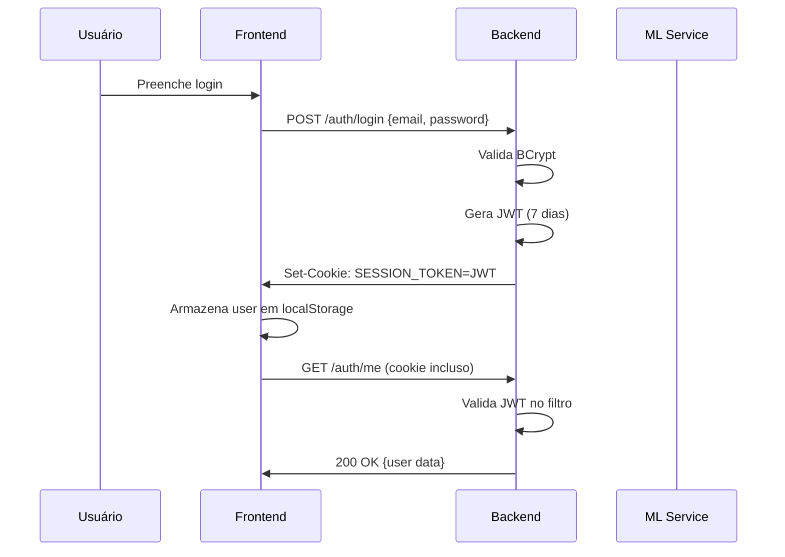

# Segurança e Autenticação

Documentação dos mecanismos de autenticação, autorização, gerenciamento de sessão e proteção de endpoints.

## Índice

- [Fluxo de Autenticação](#fluxo-de-autenticação)
- [Armazenamento de Senhas](#armazenamento-de-senhas)
- [JWT (JSON Web Token)](#jwt-json-web-token)
- [Sessão via Cookie](#sessão-via-cookie)
- [Blacklist de Tokens](#blacklist-de-tokens)
- [Redefinição de Senha pelo Admin](#redefinição-de-senha-pelo-admin)
- [Proteção de Endpoints](#proteção-de-endpoints)
- [CORS](#cors)

---

## Fluxo de Autenticação



## Armazenamento de Senhas

O sistema suporta dois algoritmos de hash para senhas:

| Algoritmo | Quando usado |
|---|---|
| **BCrypt** (Spring Security Crypto) | Todos os novos registros e redefinições de senha |
| **SHA-256 legado** | Apenas para migração de usuários existentes |

No login, o sistema tenta BCrypt primeiro. Se falhar, tenta SHA-256 legado. Se o SHA-256 funcionar, a senha é atualizada para BCrypt automaticamente.

## JWT (JSON Web Token)

### Configuração

| Parâmetro | Valor |
|---|---|
| Algoritmo | HMAC-SHA384 (`Jwts.SIG.HS384`) |
| Secret | Configurado via `JWT_SECRET` (mín. 32 caracteres) |
| Expiração | 7 dias (configurável via `JWT_EXPIRATION_MS`) |

### Payload

```json
{
  "sub": "user_id",
  "iat": 1700000000,
  "exp": 1700604800
}
```

### Geração

Realizada pelo `JwtService.java` na classe `infrastructure/config/`.

### Validação

O filtro `JwtAuthFilter.java` processa todas as requisições e:

1. Extrai o token do cookie `SESSION_TOKEN`
2. Valida a assinatura HMAC-SHA384
3. Verifica se o token não está na blacklist
4. Extrai o `userId` do `subject`
5. Adiciona o `userId` ao atributo da requisição (`SessionUserResolver`)

O filtro não bloqueia requisições sem token: a proteção de endpoints é feita nos controllers, que resolvem
o usuário da sessão via `SessionUserResolver` e retornam `401` quando o recurso exige autenticação.

## Sessão via Cookie

| Propriedade | Valor |
|---|---|
| Nome | `SESSION_TOKEN` |
| Path | `/` |
| HttpOnly | Sim (não acessível via JavaScript) |
| Secure | Configurável via `SESSION_SECURE` (true em produção) |
| SameSite | `Lax` |
| Max-Age | 7 dias (configurável via `SESSION_MAX_AGE_SECONDS`) |

O cookie é definido no login/registro e limpo no logout.

## Blacklist de Tokens

Quando o usuário faz logout, o token JWT atual é adicionado à tabela `TB_TOKEN_BLACKLIST` com a data de expiração original. A limpeza de tokens expirados é feita automaticamente a cada hora pelo `TokenBlacklistCleanupService`.

## Redefinição de Senha pelo Admin

O endpoint `POST /auth/admin/reset-password/{userId}` permite que um administrador force a redefinição de senha de qualquer usuário (o `userId` vai na URL):

```json
// Request
{ "newPassword": "NovaSenha123!" }

// Response 200
{ "message": "Senha redefinida com sucesso." }
```

Após a redefinição, o flag `password_reset_required` é marcado como `true`. O usuário, ao fazer login, é redirecionado para `/reset-password` para definir uma nova senha.

## Login com Google (SSO)

O projeto oferece login com Google (ADR-0052), implementado com o fluxo **ID Token (implícito)**:

1. O frontend usa o Google Identity Services (`@react-oauth/google`) e envia o `credential` (ID Token) para `POST /auth/google`
2. O backend valida a assinatura, o emissor e a audiência do token usando o `GOOGLE_CLIENT_ID` (cliente `google-api-client`)
3. Se o e-mail não existir, o usuário é criado automaticamente com `auth_provider = GOOGLE` (coluna adicionada na migration V16)
4. A sessão segue o mesmo fluxo de cookie `SESSION_TOKEN` do login local

O `GOOGLE_CLIENT_ID` é obrigatório para o SSO funcionar (use um valor mock em dev local). O valor do
frontend (`VITE_GOOGLE_CLIENT_ID`) deve ser idêntico ao do backend.

## Proteção de Endpoints

| Critério | Endpoints afetados |
|---|---|
| Autenticado (qualquer usuário) | `/properties/**`, `/energy-analysis`, `/energy-analysis/simulate`, `/dashboard`, `/analyses/**`, `/auth/me`, `/auth/preferences`, `/auth/reset-password`, `/auth/logout` |
| Admin | `/auth/admin/**` |
| Público | `/auth/register`, `/auth/login`, `/auth/google`, `/energy-analysis/categories`, `/appliances`, `/contract-info`, `/actuator/health`, Swagger UI (`/swagger-ui.html`, `/api-docs`) |

## CORS

Configurado via `CORS_ALLOWED_ORIGINS` (padrão: `*`). Em produção, deve ser restrito à origem do frontend.

---

> **Nota:** Consulte o [guia de execução](./guia-execucao.md) para configuração das variáveis de ambiente de segurança.
